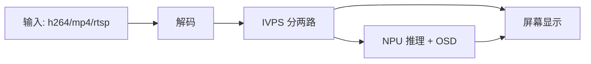
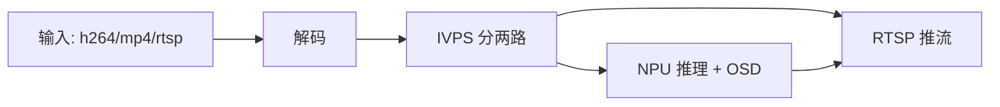
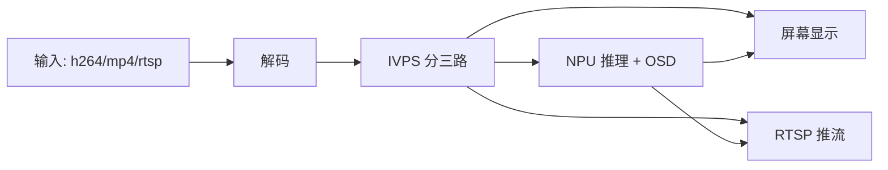
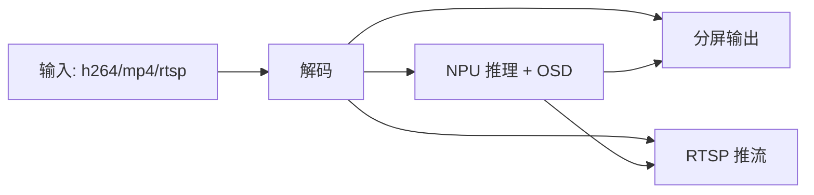
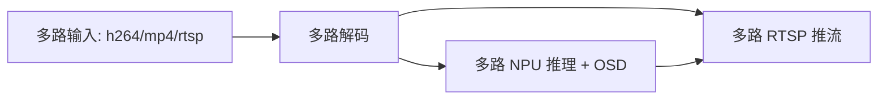
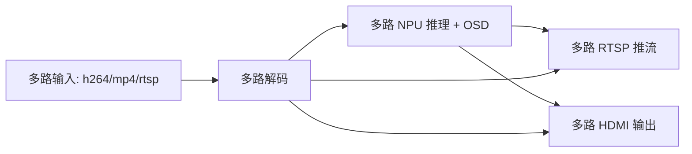

# ax-pipeline

## 简介

**AX-Pipeline** 由 **社区开发者友情** 开发。该项目基于 **AXera-Pi**系列社区板卡 展示 **NPU**、**编解码**、**显示** 等功能模块软件调用方法，方便社区开发者进行快速评估和二次开发自己的多媒体应用。

### 已支持芯片

- AX650A/AX650N
- AX8850N/AX8850

### 支持 SDK 版本

- AX650 Series
  - v3.6.2([社区版本SDK获取方式](https://www.ebaina.com/down/240000038900))   

### 已支持开发板

- AX650N DEMO Board
- [AXera-Pi Pro](https://wiki.sipeed.com/m4ndock)(AX650N)

## 快速上手

### 文档

- [快速编译](docs/compile.md)  基于 cmake 实现简单的跨平台编译。
- [如何更换自己训练的 yolov5 模型](docs/how_to_deploy_custom_yolov5_model.md)
- [如何部署自己的其他模型](docs/how_to_deploy_custom_model.md)
- [如何调整图像方向](docs/how_to_adjust_image_orientation.md)
- [ModelZoo](docs/modelzoo.md) 一些支持或将支持的模型，和一些模型的说明
- [配置文件说明](docs/config_file.md)
- [简化版本 pipeline 构建 api](docs/new_pipeline.md)
- [如何加速子模块的下载](docs/how_to_speed_up_submodule_init.md)
  
### 示例

| 示例 | 简介 | 流程图 |
| - | - | - |
| [sample_demux_ivps_npu_vo](examples/sample_demux_ivps_npu_vo) | 读取 h264/mp4/rtsp 解码，通过 IVPS 出两路视频，一路用作屏幕显示，一路用作 NPU 推理 | [查看流程图](#sample_demux_ivps_npu_vo) |
| [sample_demux_ivps_npu_rtsp](examples/sample_demux_ivps_npu_rtsp) | 读取 h264/mp4/rtsp 解码，通过 IVPS 出两路视频，一路用作 RTSP 推流，一路用作 NPU 推理 | [查看流程图](#sample_demux_ivps_npu_rtsp) |
| [sample_demux_ivps_npu_rtsp_vo](examples/sample_demux_ivps_npu_rtsp_vo) | 读取 h264/mp4/rtsp 解码，通过 IVPS 出三路视频，一路用作屏幕显示，一路用作 RTSP 推流，一路用作 NPU 推理 | [查看流程图](#sample_demux_ivps_npu_rtsp_vo) |
| [sample_demux_ivps_npu_hdmi_vo](examples/sample_demux_ivps_npu_hdmi_vo) | 读取 h264/mp4/rtsp 解码，推理多个模型并进行 OSD 后，分屏（分屏数量等于指定模型个数）同时输出到 HDMI 屏幕 | [查看流程图](#sample_demux_ivps_npu_hdmi_vo) |
| [sample_demux_ivps_npu_rtsp_hdmi_vo](examples/sample_demux_ivps_npu_rtsp_hdmi_vo) | 读取 h264/mp4/rtsp 解码，推理多个模型并进行 OSD 后，分屏（分屏数量等于指定模型个数）同时输出到 HDMI 屏幕和 RTSP 推流 | [查看流程图](#sample_demux_ivps_npu_rtsp_hdmi_vo) |
| [sample_multi_demux_ivps_npu_multi_rtsp](examples/sample_multi_demux_ivps_npu_multi_rtsp) | 读取多路 h264/mp4/rtsp 解码，分别进行推理和 OSD 后，多路 RTSP 推流输出 | [查看流程图](#sample_multi_demux_ivps_npu_multi_rtsp) |
| [sample_multi_demux_ivps_npu_hdmi_vo](examples/sample_multi_demux_ivps_npu_hdmi_vo) | 读取多路 h264/mp4/rtsp 解码，分别进行推理和 OSD 后，多路 HDMI 屏幕输出 | [查看流程图](#sample_multi_demux_ivps_npu_hdmi_vo) |
| [sample_multi_demux_ivps_npu_multi_rtsp_hdmi_vo](examples/sample_multi_demux_ivps_npu_multi_rtsp_hdmi_vo) | 读取多路 h264/mp4/rtsp 解码，分别进行推理和 OSD 后，同时输出到多路 RTSP 推流和 HDMI 屏幕 | [查看流程图](#sample_multi_demux_ivps_npu_multi_rtsp_hdmi_vo) |

### sample_demux_ivps_npu_vo

### sample_demux_ivps_npu_rtsp

### sample_demux_ivps_npu_rtsp_vo

### sample_demux_ivps_npu_rtsp_hdmi_vo

### sample_multi_demux_ivps_npu_multi_rtsp

### sample_multi_demux_ivps_npu_hdmi_vo

### sample_multi_demux_ivps_npu_multi_rtsp_hdmi_vo

## 更新日志

详情请看 [更新日志](docs/update.md)

## 联动项目

- [ax-samples](https://github.com/AXERA-TECH/ax-samples)：该项目实现了常见的 深度学习开源算法 在 爱芯元智 的 AI SoC 上的示例代码，方便社区开发者进行快速评估和适配
- [基于 AX650N 部署 YOLO11](https://zhuanlan.zhihu.com/p/772269394)
- [基于 AX620Q 部署 YOLOv8](https://zhuanlan.zhihu.com/p/683050593)
- [NPU工具链在线文档](https://pulsar2-docs.readthedocs.io/zh_CN/latest/)
- [NPU工具链获取](https://huggingface.co/AXERA-TECH/Pulsar2)

## 技术讨论

- Github issues
- QQ 群: 139953715

## **免责声明**

*本项目仅用于开发者社区技术交流使用，无任何商业交付质量承诺*
