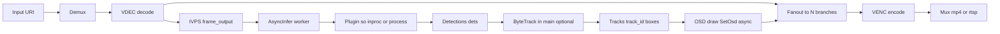
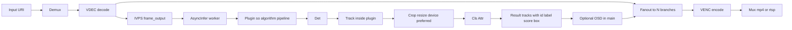

# ax-pipeline

基于 `ax-video-sdk` 的多路 pipeline 运行器示例工程(示例 app)，用于把以下链路快速跑起来:

- `demux -> decode -> (npu + osd + tracking) -> N x (encode -> mux)`

本仓库目标是提供一个简单清晰的运行入口：

- 多个 `pipeline` 并行运行
- 每个 pipeline 固定为 `1 demux + N mux`
- NPU 节点支持:
  - `yolov5` / `yolov8` 检测
  - `npu_max_fps` 限速(传 `0/-1` 关闭)
  - OSD 画框
  - ByteTrack 跟踪(按 `track_id` 固定亮色)
    - 主程序跟踪：`npu.enable_tracking=true`
    - 插件内跟踪：`yolov5/yolov8/yolov8_split` 支持在 `ax_plugin_init_info` 里配置 `enable_tracking=true`
  - 插件隔离模式:
    - `inproc`: 进程内运行(最快)
    - `process`: 子进程运行(插件崩溃不影响 pipeline)
- 通过 JSON 配置定义 pipeline 行为
- 命令行参数使用 `cmdline`

更详细文档见: [docs/README.md](docs/README.md)

## 获取源码（包含子模块）

本项目依赖 git 子模块（例如 `deps/ax-video-sdk`），建议使用递归克隆：

```bash
git clone --recurse-submodules <repo_url>
```

如果你已经克隆过仓库但子模块未拉全，可执行：

```bash
git submodule update --init --recursive
```

## 依赖

- 子模块：`deps/ax-video-sdk`
- JSON：`third-party/json/json.hpp`
- cmdline：`third-party/cmdline/cmdline.hpp`

## 构建

本项目构建方式对齐 `ax-video-sdk`：

- 板端：`AX650`、`AX620E(AX630C/AX620Q/AX620QP)`
- AXCL：x86_64 / aarch64

构建脚本与 CI 会自动准备 MSP/AXCL SDK 和 toolchain。

```bash
# AXCL x86_64 (本机)
./build_axcl_x86.sh

# AXCL aarch64 (本机，例如树莓派 64 位)
./build_axcl_aarch64.sh

# AX650 (交叉编译)
./build_ax650.sh

# AX630C (交叉编译)
./build_ax630c.sh
```

## 运行

示例配置文件：`configs/example.json`

```bash
./ax_pipeline_app -c configs/example.json -t 20
```

`-t 0` 表示一直运行直到 `Ctrl+C`。

`configs/example.json` 中的 `uri` 默认是占位路径，需要你改成真实的 `mp4` 文件路径或 `rtsp://` 地址。

### 仅解码/AI 模式（`outputs` 可为空）

如果用户只想 **拉流/读文件解码**（可选 NPU 推理），不需要编码推流/落盘，可以：

- 省略 `outputs` 字段，或配置为空数组 `[]`

此时 pipeline 链路为：

- `demux -> decode -> (可选 npu)`

注意：没有编码输出时，即使开启了 `npu.enable_osd=true`，OSD 也不会出现在可播放的输出流上（OSD 仅作用在编码路径）。

## 插件隔离模式：性能取舍

`npu.ax_plugin_isolation` 可选：

- `inproc`：插件在主进程 `dlopen` 并直接调用 C API。
  - 优点：额外开销几乎为 0，延迟最低。
  - 风险：插件崩溃会带崩主进程。
- `process`：插件在子进程执行，主进程通过 IPC 交互。
  - 优点：插件崩溃可隔离，主进程可继续转码/推流(最多丢失 AI 结果)。
  - 代价：有 IPC 开销，并可能引入额外排队延迟；如果需要把大块数据搬到 host，开销会更明显。

建议把 `inproc vs process` 纳入压测：

- 同一输入视频、相同 `frame_output`、相同 `npu_max_fps`，分别跑两种隔离模式。
- 对比 NPU 吞吐(单位时间内推理次数)和端到端 RTSP 卡顿/延迟。
  - `inproc` 通常最佳。
  - `process` 通常更稳但会慢一些，具体取决于你的插件实现是否发生了额外拷贝。

## 参考流程图

### 单模型插件 + 主程序 ByteTrack/OSD

适用场景：插件只做单模型推理(如 YOLOv5/v8 检测)，跟踪与 OSD 由主程序完成(可开关)。


```mermaid
flowchart LR
  A[Input URI] --> B[Demux]
  B --> C[VDEC decode]
  C --> D[IVPS frame_output]
  D --> E[AsyncInfer worker]
  E --> F[Plugin so inproc or process]
  F --> G[Detections dets]
  G --> H[ByteTrack in main optional]
  H --> I[Tracks track_id boxes]
  I --> J[OSD draw SetOsd async]
  C --> K[Fanout to N branches]
  J --> K
  K --> L[VENC encode]
  L --> M[Mux mp4 or rtsp]
```

### 关闭主程序 Track：插件内部实现算法链路

适用场景：用户希望在插件内做完整链路(检测 + 跟踪 + 分类/属性等)，主程序只负责媒体链路与可选的 OSD 展示。


```mermaid
flowchart LR
  A[Input URI] --> B[Demux]
  B --> C[VDEC decode]
  C --> D[IVPS frame_output]
  D --> E[AsyncInfer worker]
  E --> F[Plugin so algorithm pipeline]
  F --> G1[Det]
  G1 --> G2[Track inside plugin]
  G2 --> G3[Crop resize device preferred]
  G3 --> G4[Cls Attr]
  G4 --> R[Result tracks with id label score box]
  R --> O[Optional OSD in main]
  C --> K[Fanout to N branches]
  O --> K
  K --> L[VENC encode]
  L --> M[Mux mp4 or rtsp]
```

## 插件内跟踪配置（yolov5/yolov8/yolov8_split）

三个内置 YOLO 插件都支持在插件内部开启 ByteTrack 跟踪，并通过 `det.track_id` 输出稳定 id：

- 在 `npu.ax_plugin_init_info` 中配置：
  - `enable_tracking`：`true/false`
  - `track_fps`：跟踪器帧率（默认 30）
  - `track_buffer`：跟踪缓冲（默认 30）
  - `track_min_score`：低于该阈值的 det 不参与跟踪（默认 0）
- 若启用了插件内跟踪，建议把 pipeline 侧跟踪关掉：`npu.enable_tracking=false`（避免双重跟踪）
- 自定义插件也可以在插件内直接复用 `axpipeline::tracking::ByteTrack`（见 `include/tracking/ax_bytetrack.hpp`），方便做多级模型推理链路

## 配置格式（简化）

```json
{
  "system": { "device_id": -1 },
  "pipelines": [
    {
      "name": "p0",
      "device_id": -1,
      "uri": "xxx.mp4 或 rtsp://...",
      "realtime_playback": false,
      "loop_playback": false,
      "frame_output": {
        "format": "bgr",
        "width": 640,
        "height": 640,
        "resize": { "mode": "keep_aspect", "background_color": 0 }
      },
      "outputs": [
        { "codec": "h264", "uris": ["/tmp/out.mp4", "rtsp://..."] }
      ],
      "npu_max_fps": 20,
      "npu": {
        "enable": true,
        "enable_osd": true,
        "enable_tracking": false,
        "track_buffer": 30,
        "ax_plugin_path": "/path/to/libax_plugin_yolov8.so",
        "ax_plugin_isolation": "inproc",
        "ax_plugin_init_info": {
          "model_path": "models/ax650/yolov8s.axmodel",
          "enable_tracking": true,
          "track_fps": 30,
          "track_buffer": 30,
          "track_min_score": 0.0,
          "num_classes": 80,
          "conf_threshold": 0.25,
          "nms_threshold": 0.45
        }
      },
      "log_every_n_frames": 30
    }
  ]
}
```

## 测试

```bash
cmake -S . -B build -DAXSDK_CHIP_TYPE=axcl -DAXSDK_AXCL_DIR=/usr
cmake --build build -j
ctest --test-dir build -V
```
