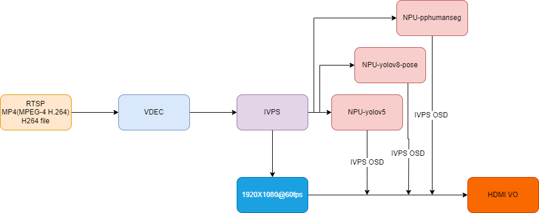

## 简介
  通过 RTSP/MP4 输入，实现算力盒子。

## 流程图


## 环境准备
rtsp服务及推拉流配置请参考   [rtsp-simple-server](../../docs/rtsp.md)

## 快速体验
1、运行以下命令，进行 rtsp 的取流、解码、推理，并通过 HDMI 显示输出结果。
```
./sample_demux_ivps_npu_hdmi_vo -f rtsp://192.168.31.1:8554/test -p config/yolov5s.json
```

2、运行以下命令，进行 mp4/h264 文件的解包、解码、推理，并通过 HDMI 显示输出结果。
```
./sample_demux_ivps_npu_hdmi_vo -f test.h264 -p config/yolov5s.json
```

3、运行以下命令，进行 mp4/h264 文件的解包、解码、推理，可同时推几种不一样的模型，并在HDMI屏幕上进行分块显示输出结果。
```
./sample_demux_ivps_npu_hdmi_vo -f test.h264 -p config/yolov5s.json -p config/yolov8_pose.json -p config/yolox.json
```