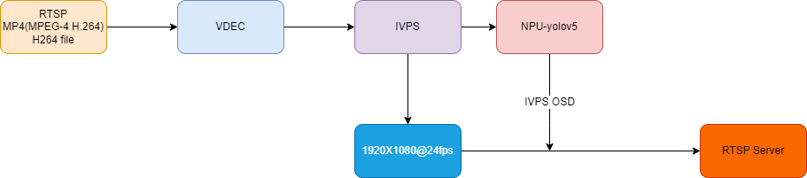

## 简介
  通过 RTSP/MP4 输入，实现算力盒子。

## 流程图


## 快速体验
```bash
Usage:./sample_demux_ivps_npu_rtsp -h for help

        -p: model config file path
        -f: mp4 file/rtsp url(just only support h264 format)
        -l: loop play video
        -r: sample framerate
```

```
./sample_demux_ivps_npu_rtsp -f xxx.mp4 -l 1 -p config/yolov5s.json -r 25
```
