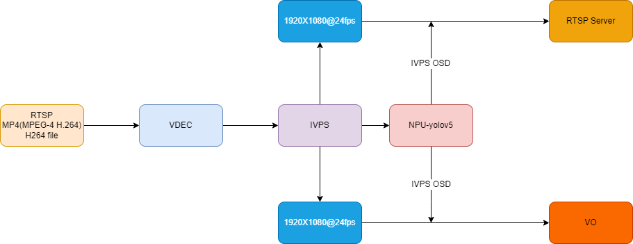

## 简介
  通过 RTSP/MP4 输入，实现算力盒子。

## 流程图


## 环境准备
rtsp服务及推拉流配置请参考   [rtsp-simple-server](../../docs/rtsp.md)

## 快速体验
1、运行以下命令，进行 rtsp 的取流、解码、推理, 并同时通过 HDMI 输出显示 和 rtsp 推流 输出结果。
```
./sample_demux_ivps_npu_rtsp_hdmi_vo -f rtsp://192.168.31.1:8554/test -p config/yolov5s.json
```
2、运行以下命令，进行 mp4/h264 文件的解包、解码、推理, 并同时通过 HDMI 输出显示 和 rtsp 推流 输出结果。
```
./sample_demux_ivps_npu_rtsp_hdmi_vo -f rtsp://192.168.31.1:8554/test -p config/yolov5s.json
```